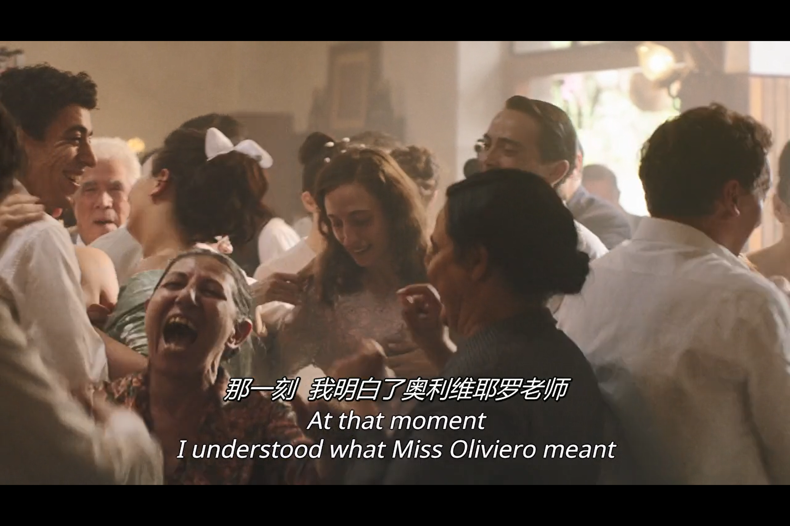
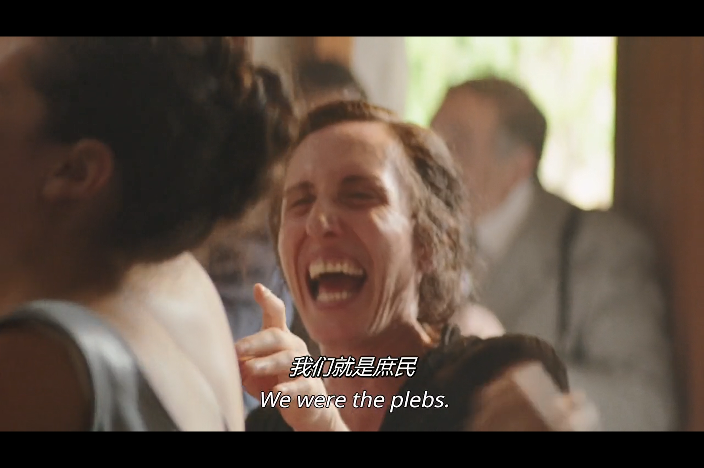
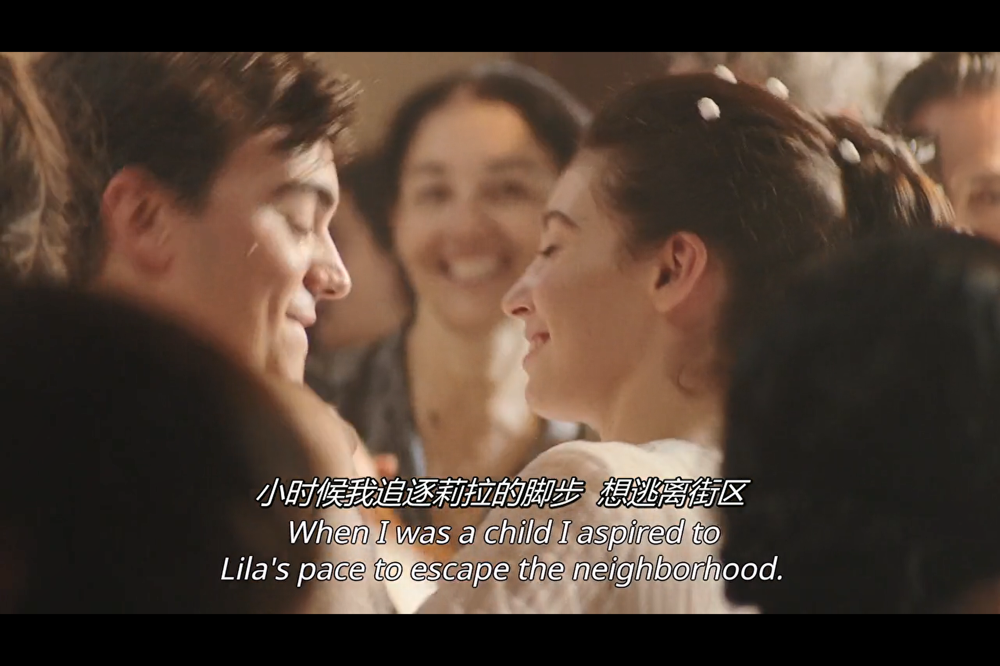

# 感谢HBO

送别我的天才女友第一季。My brilliant friend.

直戳心底的撕开伤口的饱含情绪的真实。这生活怎么就成了小说，又成了电视剧。

HBO的功底受我一拜。
一边看的时候心纠结，紧绷着，无法呼吸的现实包裹着我。
一边又为欣赏到这般高度的艺术创作一阵酥麻的开心。

从既定的生活中挣脱需要多大的努力啊，敢于说不的人绝不懦弱，而成为这一边受苦又一边维护旧团体的一员的人尤其可怜可恨。可一个人的挣扎又能给自己带来什么，格格不入的人生，所有人与自己为敌，越坚强的人，越受伤。只有到死的时候，才能解脱。
<!-- more -->

# 截图

# 直面惨淡人生 李银河

​      在我的一生当中，人生哲学对我来说是一位不可或缺的朋友，是一位频繁来访的朋友，又是一位永远无法彻底了解他的、神秘而可怕的朋友。

​       像罗素在5岁时想道：我的漫长的生涯才过了1/14，因而感到无边的惆怅一样，我也是从很小就开始思索宇宙和人生的问题。有一段时间，我不敢长时间地仰望星空，因为从中看到人生的荒芜，冰冷，无意义。我无法接受这个可怜的生命仅仅在无边的宇宙中像一粒微尘一样存在过短短的一段时间然后永远消失不见的残酷事实。荣格说，这个问题不能常想，否则人会疯掉。我却常常想，不由自主，至今尚未疯掉只能说明我的神经质地坚韧，而且不是一般的坚韧。

​       这种思考方式和生活方式也并非全无益处。一个显而易见的益处就是，无论碰到什么样的灾难或看似难以逾越的障碍，只要像我惯常所做的那样，往深处想想宇宙和人生，想想宇宙的广袤，想想人生的无意义，这些貌似难以逾越的大墙就会登时分崩离析，轰然倒塌，消除于无形。就连让人一想起来就热泪盈眶的爱情之火都可以熄灭，就连最令人心旷神怡的景色都可以黯然失色。因为在宇宙最终的熵增的一片混沌中，所有这一切都不过是一粒微尘而已，甚至连微尘都算不上，如果它仅仅是人这种渺小生物的一种感觉或痴迷。

​       我相信，宗教最初就是这样产生的，因为宇宙和人生的这个真相实在太过残酷，令人无法直视，人们只好幻想出种种美好的天堂、神祗、意义和价值，使得人生可以忍受，使得真相不显得那么生硬刺目，那么赤裸裸，那么令人惨不忍睹。在这个意义上，我羡慕那些信神的人，哪怕是那些不是清醒地而只是懵懵懂懂地信神的人，他们的人生比我的比较容易忍受。但是难道他们真是清醒的吗，他们坚信不疑的事情是真实的吗？

​       我的心底始终是无神论的。至多不过是古希腊罗马人那样泛神论的。他们心目中的神祗不过是一种美好的神话传说，就像童话故事一样。虽然不情不愿，但是我的理智和我所受到的所有教育都告诉我，无神论是唯一的真理。承认这个是需要一点勇气的：既然根本无神，你就只能把眼睛拼命地睁开，直面宇宙的荒芜和人生的无意义。

​       我很年轻时就接触过存在主义，它立即吸引了我的全部注意力，因为它说出残酷的真理：存在纯属偶然，人生全无意义。存在主义同时为人生指明出路：人可以选择，并自己去承受选择的后果。既然人生没有意义，人为什么还要活着，还有什么必要？既然没有必要，是不是只有去死这一种选择了呢？

​       存在主义的回答是，可以有多种选择：可以选择死，也可以选择活；可以选择这样活，也可以选择那样活。于是，我愿意我的人生更多出于自己的选择，较少出于外部力量的强迫。即便这样，有些事情还是会强加在我身上。比如，我选择了爱情，但是命运（偶然性）却最终残忍地让它夭折；我想选择文学，命运却不给我艺术家的忧郁，而随手给了我明晰和单纯（本雅明认为这两项品质不属于艺术家）。当然，在可能的范围内，我还是要尽量地选择，而不是被动地接受命运的安排，因为这才是存在，否则不是存在。

​       萨特有一次说：“在不存在和这种浑身充满快感的存在之间，是没有中立的。如果我们存在，**就必须存在到这样的程度**。”这话说得够决绝，人或者存在，或者不存在，没有中间项；而存在与否的标准在于是否浑身充满快感。按照这个标准，这个地球上存在的人并不太多，至少不是时时存在的。这个标准听上去简单，但是实施起来却并非易事，仅仅观念一项就可以扼杀无数人获得快感的愿望和机会，遑论习俗、文化、五花八门的行为规范。可是，萨特所指出的难道不是唯一可能的存在方式吗？

​       既然宇宙是如此浩渺荒芜，既然人生全无意义，快感的存在是我们唯一的选择。我愿意选择存在，尽管它最终还是无法改变存在并无意义这一残酷事实。